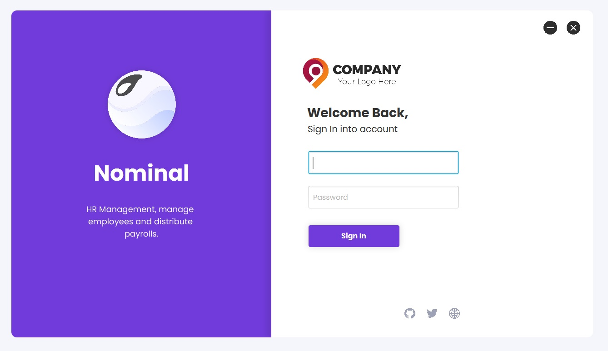
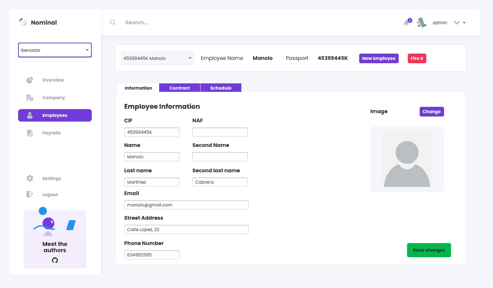

[![Contributors][contributors-shield]][contributors-url]
[![Forks][forks-shield]][forks-url]
[![Issues][issues-shield]][issues-url]
[![MIT License][license-shield]][license-url]

<!-- PROJECT LOGO -->
 

  

  <h3 align="center"><b>Nominal</b></h3>

  

    Company Employee Managing System
     
     
    <!-- <a href="https://github.com/github_username/repo_name">View Demo</a>
    ·
    <a href="https://github.com/github_username/repo_name/issues">Report Bug</a>
    ·
    <a href="https://github.com/github_username/repo_name/issues">Request Feature</a> -->
  

## Getting Started

To get a local copy up and running follow these simple steps.

### Steps

- Use IntelliJ and Open /client directory as a project.
- Update maven dependencies
- Use JDK16
- Configure Database credentials with DatabaseCredentials on **/configuration** in source folder.
- Execute database scripts sample on **/server/database/*.sql**

### Running

1. Add maven configuration and setup a maven goal **javafx:run** 
2. Run the project and login with default **admin**:**admin**

<!-- MARKDOWN LINKS & IMAGES -->
<!-- https://www.markdownguide.org/basic-syntax/#reference-style-links -->
[contributors-shield]: https://img.shields.io/github/contributors/pomaretta/company-manager.svg?style=for-the-badge
[contributors-url]: https://github.com/pomaretta/company-manager/graphs/contributors
[forks-shield]: https://img.shields.io/github/forks/pomaretta/company-manager.svg?style=for-the-badge
[forks-url]: https://github.com/pomaretta/company-manager/network/members
[issues-shield]: https://img.shields.io/github/issues/pomaretta/company-manager.svg?style=for-the-badge
[issues-url]: https://github.com/pomaretta/company-manager/issues
[license-shield]: https://img.shields.io/github/license/pomaretta/company-manager.svg?style=for-the-badge
[license-url]: https://github.com/pomaretta/company-manager/blob/master/LICENSE.txt